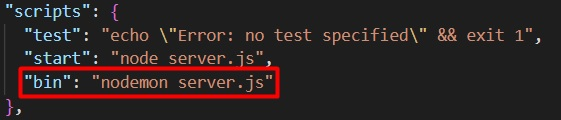

# BIN-API-DCAS
BIN-API (Basic Interconnected Node API) for Dental Clinic Appointment System, created using MongoDB, and Express.

# API Development
### You must have installed:
  
> nodejs (https://nodejs.org/en/download)

> express (npm install express)

> nodemon (npm install -g nodemon)

> dotenv (npm install dotenv)

> mongoose (npm install mongoose)

> cors (npm install cors)

> bcrypt (npm install bcrypt)

> validator (npm install validator)

> jsonwebtoken (npm install jsonwebtoken)

### To run this specific API, type in your terminal 'npm run bin'.
If you want to change this, go to 'package.json' and create a new script or edit the script that I have by default.

The below image is my default script. You can change it depending on your preferences.

